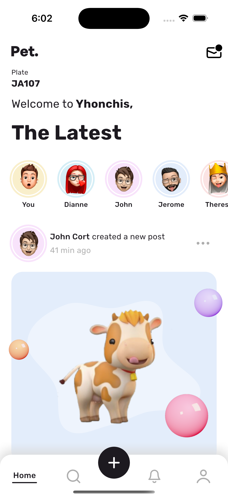

# Pet App

## Descripción

Pet App es una aplicación diseñada para gestionar la información de tus mascotas. Permite registrar, actualizar y visualizar datos relevantes de cada mascota.

## Instalación

1. Clona el repositorio:

```bash
git clone https://github.com/yhonchisdev/pets_app.git
```

2. Navega al directorio del proyecto:

```bash
cd pet_app
```

3. Instala las dependencias:

```bash
flutter pub get
```

## Ejecución

1. Inicia la aplicación:

```bash
flutter run
```

2. Conecta un dispositivo físico o inicia un emulador para ejecutar la aplicación.

## Decisiones Técnicas

- **Framework**: Se utilizó Flutter para la construcción de la interfaz de usuario debido a su eficiencia y capacidad de crear aplicaciones nativas para múltiples plataformas.
- **Estado Global**: Se implementó Riverpod para la gestión del estado global de la aplicación, facilitando la manipulación y acceso a los datos.
- **APIs**: Se utilizaron APIs mockeadas para simular la comunicación con el backend durante el desarrollo.
- **Diseño Visual**: Se prestó especial atención al diseño visual para asegurar una experiencia de usuario atractiva y coherente.
- **Buenas Prácticas**: Se siguieron buenas prácticas de desarrollo para asegurar la mantenibilidad y escalabilidad del código.

## Captura de Pantalla


